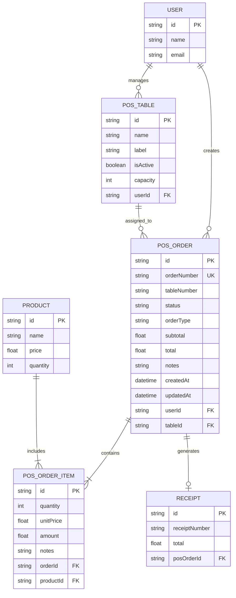

# 🏗️ Technical Architecture Document: Invo POS Module

**Document Type:** Technical Architecture
**Product:** Invo POS Module
**Last Updated:** 2025-01-15
**Status:** Implementation Ready

---

## 1. Architecture Design

```mermaid
graph TD
    A[User Browser] --> B[React Frontend - POS Module]
    B --> C[Next.js API Routes]
    C --> D[Prisma ORM]
    D --> E[SQLite Database]
    C --> F[Bluetooth Print Service]
    C --> G[Offline Storage Service]
    
    subgraph "Frontend Layer"
        B
        H[POS Components]
        I[Order Management]
        J[Table Management]
    end
    
    subgraph "Backend Layer"
        C
        F
        G
    end
    
    subgraph "Data Layer"
        D
        E
    end
    
    subgraph "Integration Points"
        K[Receipts Module]
        L[Inventory Module]
        M[Dashboard Module]
    end
    
    C --> K
    C --> L
    C --> M
end
```

## 2. Technology Description

- **Frontend:** React@18 + Next.js@14 + TypeScript + Tailwind CSS
- **Backend:** Next.js API Routes + Prisma ORM
- **Database:** SQLite (existing)
- **State Management:** React Context + Local Storage (offline support)
- **UI Components:** Shadcn/ui (existing design system)
- **Printing:** Web Bluetooth API + Generic ESC/POS commands
- **Offline Support:** IndexedDB + Service Worker

## 3. Route Definitions

| Route | Purpose |
|-------|----------|
| /dashboard/pos | Main POS dashboard with tabs (New Order, Orders, Settings) |
| /dashboard/pos/new | Create new order page |
| /dashboard/pos/orders | Order management and status tracking |
| /dashboard/pos/orders/[id] | Individual order details and actions |
| /dashboard/pos/tables | Table management and configuration |
| /dashboard/pos/settings | POS-specific settings and printer configuration |

## 4. API Definitions

### 4.1 Core POS APIs

**Order Management**
```
POST /api/pos/orders
```

Request:
| Param Name | Param Type | isRequired | Description |
|------------|------------|------------|--------------|
| tableNumber | string | true | Table identifier or custom label |
| items | OrderItem[] | true | Array of order items |
| notes | string | false | Order-level notes |
| orderType | string | true | 'DINE_IN' or 'TAKEAWAY' |

Response:
| Param Name | Param Type | Description |
|------------|------------|-------------|
| id | string | Order ID |
| orderNumber | string | Generated order number |
| status | string | Order status |
| total | number | Order total amount |

Example:
```json
{
  "tableNumber": "Table 5",
  "orderType": "DINE_IN",
  "items": [
    {
      "productId": "prod_123",
      "quantity": 2,
      "unitPrice": 15.50,
      "notes": "no chili"
    }
  ],
  "notes": "Customer allergic to nuts"
}
```

**Order Status Update**
```
PATCH /api/pos/orders/[id]/status
```

Request:
| Param Name | Param Type | isRequired | Description |
|------------|------------|------------|--------------|
| status | string | true | New status: 'KITCHEN', 'TO_PAY', 'COMPLETED', 'CANCELLED' |

Response:
| Param Name | Param Type | Description |
|------------|------------|-------------|
| success | boolean | Operation success status |
| order | Order | Updated order object |

**Kitchen Chit Printing**
```
POST /api/pos/print/chit
```

Request:
| Param Name | Param Type | isRequired | Description |
|------------|------------|------------|--------------|
| orderId | string | true | Order ID to print |
| printerAddress | string | false | Bluetooth printer address |

Response:
| Param Name | Param Type | Description |
|------------|------------|-------------|
| success | boolean | Print operation success |
| message | string | Status message |

**Table Management**
```
GET /api/pos/tables
POST /api/pos/tables
PUT /api/pos/tables/[id]
DELETE /api/pos/tables/[id]
```

### 4.2 Integration APIs

**Receipt Generation (Integration with existing receipts module)**
```
POST /api/pos/orders/[id]/generate-receipt
```

**Inventory Update (Integration with existing inventory module)**
```
PATCH /api/pos/orders/[id]/update-inventory
```

## 5. Server Architecture Diagram

```mermaid
graph TD
    A[Client / POS Frontend] --> B[API Route Handler]
    B --> C[POS Service Layer]
    C --> D[Order Repository]
    C --> E[Table Repository]
    C --> F[Print Service]
    C --> G[Integration Service]
    D --> H[(Database - Orders)]
    E --> H
    G --> I[Receipts Module]
    G --> J[Inventory Module]
    F --> K[Bluetooth Printer]
    
    subgraph "POS Server Layer"
        B
        C
        D
        E
        F
        G
    end
    
    subgraph "External Integrations"
        I
        J
        K
    end
end
```

## 6. Data Model

### 6.1 Data Model Definition



### 6.2 Data Definition Language

**POS Order Table (pos_orders)**
```sql
-- Create POS Order table
CREATE TABLE pos_orders (
    id TEXT PRIMARY KEY DEFAULT (lower(hex(randomblob(16)))),
    order_number TEXT UNIQUE NOT NULL,
    table_number TEXT NOT NULL,
    table_id TEXT,
    status TEXT NOT NULL DEFAULT 'KITCHEN' CHECK (status IN ('KITCHEN', 'TO_PAY', 'COMPLETED', 'CANCELLED')),
    order_type TEXT NOT NULL DEFAULT 'DINE_IN' CHECK (order_type IN ('DINE_IN', 'TAKEAWAY')),
    subtotal REAL NOT NULL DEFAULT 0,
    tax_rate REAL NOT NULL DEFAULT 0,
    tax_amount REAL NOT NULL DEFAULT 0,
    total REAL NOT NULL DEFAULT 0,
    notes TEXT,
    created_at DATETIME DEFAULT CURRENT_TIMESTAMP,
    updated_at DATETIME DEFAULT CURRENT_TIMESTAMP,
    user_id TEXT NOT NULL,
    FOREIGN KEY (user_id) REFERENCES User(id) ON DELETE CASCADE,
    FOREIGN KEY (table_id) REFERENCES pos_tables(id) ON DELETE SET NULL
);

-- Create indexes
CREATE INDEX idx_pos_orders_user_id ON pos_orders(user_id);
CREATE INDEX idx_pos_orders_status ON pos_orders(status);
CREATE INDEX idx_pos_orders_created_at ON pos_orders(created_at DESC);
CREATE INDEX idx_pos_orders_table_number ON pos_orders(table_number);
```

**POS Order Items Table (pos_order_items)**
```sql
-- Create POS Order Items table
CREATE TABLE pos_order_items (
    id TEXT PRIMARY KEY DEFAULT (lower(hex(randomblob(16)))),
    quantity INTEGER NOT NULL,
    unit_price REAL NOT NULL,
    amount REAL NOT NULL,
    notes TEXT,
    created_at DATETIME DEFAULT CURRENT_TIMESTAMP,
    updated_at DATETIME DEFAULT CURRENT_TIMESTAMP,
    order_id TEXT NOT NULL,
    product_id TEXT NOT NULL,
    FOREIGN KEY (order_id) REFERENCES pos_orders(id) ON DELETE CASCADE,
    FOREIGN KEY (product_id) REFERENCES Product(id) ON DELETE CASCADE
);

-- Create indexes
CREATE INDEX idx_pos_order_items_order_id ON pos_order_items(order_id);
CREATE INDEX idx_pos_order_items_product_id ON pos_order_items(product_id);
```

**POS Tables Table (pos_tables)**
```sql
-- Create POS Tables table
CREATE TABLE pos_tables (
    id TEXT PRIMARY KEY DEFAULT (lower(hex(randomblob(16)))),
    name TEXT NOT NULL,
    label TEXT,
    is_active BOOLEAN DEFAULT TRUE,
    capacity INTEGER DEFAULT 4,
    position_x REAL DEFAULT 0,
    position_y REAL DEFAULT 0,
    created_at DATETIME DEFAULT CURRENT_TIMESTAMP,
    updated_at DATETIME DEFAULT CURRENT_TIMESTAMP,
    user_id TEXT NOT NULL,
    FOREIGN KEY (user_id) REFERENCES User(id) ON DELETE CASCADE
);

-- Create indexes
CREATE INDEX idx_pos_tables_user_id ON pos_tables(user_id);
CREATE INDEX idx_pos_tables_is_active ON pos_tables(is_active);
```

**POS Settings Table (pos_settings)**
```sql
-- Create POS Settings table
CREATE TABLE pos_settings (
    id TEXT PRIMARY KEY DEFAULT (lower(hex(randomblob(16)))),
    auto_print_enabled BOOLEAN DEFAULT FALSE,
    default_printer_address TEXT,
    table_layout_type TEXT DEFAULT 'LIST' CHECK (table_layout_type IN ('LIST', 'MAP')),
    tax_rate REAL DEFAULT 0,
    service_charge_rate REAL DEFAULT 0,
    created_at DATETIME DEFAULT CURRENT_TIMESTAMP,
    updated_at DATETIME DEFAULT CURRENT_TIMESTAMP,
    user_id TEXT NOT NULL UNIQUE,
    FOREIGN KEY (user_id) REFERENCES User(id) ON DELETE CASCADE
);
```

**Initial Data**
```sql
-- Insert default tables for new POS users
INSERT INTO pos_tables (name, label, user_id) VALUES 
('T1', 'Table 1', '1'),
('T2', 'Table 2', '1'),
('T3', 'Table 3', '1'),
('T4', 'Table 4', '1'),
('TAKEAWAY', 'Takeaway Counter', '1');

-- Insert default POS settings
INSERT INTO pos_settings (user_id) VALUES ('1');
```

## 7. Component Architecture

### 7.1 Frontend Component Structure

```
src/
├── app/
│   └── (dashboard)/
│       └── pos/
│           ├── layout.tsx
│           ├── page.tsx
│           ├── new/
│           │   └── page.tsx
│           ├── orders/
│           │   ├── page.tsx
│           │   └── [id]/
│           │       └── page.tsx
│           ├── tables/
│           │   └── page.tsx
│           └── settings/
│               └── page.tsx
├── components/
│   └── pos/
│       ├── order-form.tsx
│       ├── order-list.tsx
│       ├── order-card.tsx
│       ├── table-selector.tsx
│       ├── table-grid.tsx
│       ├── product-selector.tsx
│       ├── kitchen-chit.tsx
│       ├── print-service.tsx
│       ├── pos-settings.tsx
│       └── offline-indicator.tsx
├── lib/
│   └── pos/
│       ├── pos-service.ts
│       ├── print-service.ts
│       ├── offline-storage.ts
│       └── pos-utils.ts
└── types/
    └── pos.ts
```

### 7.2 Key Component Specifications

**OrderForm Component**
- Table selection dropdown
- Product search and selection
- Quantity controls with +/- buttons
- Item notes input
- Order total calculation
- Send to Kitchen button

**OrderList Component**
- Filterable order cards
- Status badges with color coding
- Swipe gestures for status updates
- Real-time order updates

**TableSelector Component**
- Grid or list view toggle
- Table availability status
- Quick table switching
- Custom table labels

**PrintService Component**
- Bluetooth printer discovery
- ESC/POS command generation
- Print queue management
- Offline print caching

## 8. Integration Points

### 8.1 Receipts Module Integration

**Automatic Receipt Generation:**
- When POS order status changes to 'COMPLETED'
- Create corresponding Receipt record
- Link POS order ID to receipt
- Copy order items to receipt items

**Implementation:**
```typescript
// In POS order completion handler
async function completeOrder(orderId: string) {
  const order = await prisma.posOrder.findUnique({
    where: { id: orderId },
    include: { items: { include: { product: true } } }
  });
  
  // Create receipt
  const receipt = await prisma.receipt.create({
    data: {
      receiptNumber: generateReceiptNumber(),
      customerName: order.tableNumber,
      total: order.total,
      userId: order.userId,
      items: {
        create: order.items.map(item => ({
          quantity: item.quantity,
          unitPrice: item.unitPrice,
          productId: item.productId,
          description: item.product.name
        }))
      }
    }
  });
  
  // Update order status
  await prisma.posOrder.update({
    where: { id: orderId },
    data: { status: 'COMPLETED' }
  });
}
```

### 8.2 Inventory Module Integration

**Stock Validation:**
- Check product availability before adding to order
- Show stock levels in product selector
- Prevent ordering out-of-stock items

**Stock Deduction:**
- Deduct inventory when order is completed
- Handle stock management disabled products
- Batch inventory updates for performance

**Implementation:**
```typescript
// Stock validation during order creation
async function validateOrderItems(items: OrderItem[]) {
  for (const item of items) {
    const product = await prisma.product.findUnique({
      where: { id: item.productId }
    });
    
    if (!product.disableStockManagement && product.quantity < item.quantity) {
      throw new Error(`Insufficient stock for ${product.name}`);
    }
  }
}

// Inventory deduction on order completion
async function updateInventoryForOrder(orderId: string) {
  const order = await prisma.posOrder.findUnique({
    where: { id: orderId },
    include: { items: true }
  });
  
  for (const item of order.items) {
    await prisma.product.update({
      where: { id: item.productId },
      data: {
        quantity: {
          decrement: item.quantity
        }
      }
    });
  }
}
```

### 8.3 Dashboard Integration

**POS Metrics:**
- Add POS order count to dashboard
- Daily POS sales summary
- Active orders indicator
- Top-selling items from POS

**Navigation:**
- Add POS tab to main navigation
- POS quick actions in dashboard
- Order notifications

## 9. Offline Support Implementation

### 9.1 Offline Storage Strategy

**Local Storage Structure:**
```typescript
interface OfflineOrder {
  id: string;
  orderNumber: string;
  tableNumber: string;
  items: OrderItem[];
  total: number;
  status: 'PENDING_SYNC' | 'SYNCED';
  createdAt: Date;
  lastModified: Date;
}

// IndexedDB schema
const offlineDB = {
  orders: 'id, orderNumber, tableNumber, status, createdAt',
  orderItems: 'id, orderId, productId, quantity',
  syncQueue: 'id, action, data, timestamp'
};
```

### 9.2 Sync Logic

**Background Sync:**
- Service Worker for background synchronization
- Conflict resolution for concurrent edits
- Retry mechanism for failed syncs
- Progress indicators for sync status

**Implementation:**
```typescript
// Sync service
class POSSyncService {
  async syncPendingOrders() {
    const pendingOrders = await this.getOfflineOrders();
    
    for (const order of pendingOrders) {
      try {
        await this.syncOrderToServer(order);
        await this.markOrderAsSynced(order.id);
      } catch (error) {
        console.error('Sync failed for order:', order.id, error);
        // Add to retry queue
      }
    }
  }
  
  async handleConflict(localOrder: Order, serverOrder: Order) {
    // Last-write-wins strategy
    return localOrder.lastModified > serverOrder.updatedAt 
      ? localOrder 
      : serverOrder;
  }
}
```

## 10. Printing Implementation

### 10.1 Bluetooth Printing Service

**ESC/POS Command Generation:**
```typescript
class KitchenChitPrinter {
  generateChitCommands(order: POSOrder): Uint8Array {
    const commands = [];
    
    // Initialize printer
    commands.push(0x1B, 0x40); // ESC @
    
    // Header
    commands.push(...this.textToBytes(`TABLE: ${order.tableNumber}\n`));
    commands.push(...this.textToBytes(`ORDER: ${order.orderNumber}\n`));
    commands.push(...this.textToBytes(`TIME: ${new Date().toLocaleTimeString()}\n`));
    commands.push(...this.textToBytes('\n'));
    
    // Items
    for (const item of order.items) {
      const line = `${item.quantity}x ${item.product.name}`;
      commands.push(...this.textToBytes(line + '\n'));
      
      if (item.notes) {
        commands.push(...this.textToBytes(`  * ${item.notes}\n`));
      }
    }
    
    // Footer
    commands.push(...this.textToBytes('\n'));
    commands.push(...this.textToBytes('--- END OF ORDER ---\n'));
    
    // Cut paper
    commands.push(0x1D, 0x56, 0x42, 0x00);
    
    return new Uint8Array(commands);
  }
  
  async printChit(order: POSOrder, printerAddress?: string) {
    try {
      const device = await navigator.bluetooth.requestDevice({
        filters: [{ services: ['000018f0-0000-1000-8000-00805f9b34fb'] }]
      });
      
      const server = await device.gatt.connect();
      const service = await server.getPrimaryService('000018f0-0000-1000-8000-00805f9b34fb');
      const characteristic = await service.getCharacteristic('00002af1-0000-1000-8000-00805f9b34fb');
      
      const commands = this.generateChitCommands(order);
      await characteristic.writeValue(commands);
      
      return { success: true };
    } catch (error) {
      console.error('Print failed:', error);
      return { success: false, error: error.message };
    }
  }
}
```

## 11. Implementation Roadmap

### Phase 1: Core Infrastructure (Week 1-2)
- [ ] Database schema migration
- [ ] Basic API routes setup
- [ ] POS navigation integration
- [ ] Basic order creation form

### Phase 2: Order Management (Week 3-4)
- [ ] Order listing and filtering
- [ ] Status management
- [ ] Table management
- [ ] Product integration

### Phase 3: Integration (Week 5-6)
- [ ] Receipts module integration
- [ ] Inventory integration
- [ ] Dashboard metrics
- [ ] Settings configuration

### Phase 4: Advanced Features (Week 7-8)
- [ ] Bluetooth printing
- [ ] Offline support
- [ ] Order history and reporting
- [ ] Performance optimization

### Phase 5: Testing & Polish (Week 9-10)
- [ ] End-to-end testing
- [ ] Mobile responsiveness
- [ ] Error handling
- [ ] Documentation

## 12. Performance Considerations

### 12.1 Database Optimization
- Proper indexing on frequently queried fields
- Pagination for order lists
- Efficient joins for order items
- Connection pooling for high concurrency

### 12.2 Frontend Optimization
- Lazy loading of POS components
- Virtual scrolling for large order lists
- Debounced search inputs
- Optimistic UI updates

### 12.3 Real-time Updates
- WebSocket connections for order status updates
- Server-sent events for kitchen notifications
- Efficient state management
- Minimal re-renders

## 13. Security Considerations

### 13.1 Data Protection
- User-scoped data access
- Input validation and sanitization
- SQL injection prevention
- XSS protection

### 13.2 Bluetooth Security
- Secure pairing with printers
- Encrypted communication
- Device authentication
- Permission management

### 13.3 Offline Security
- Encrypted local storage
- Secure sync protocols
- Data integrity checks
- Access control

This technical architecture provides a comprehensive foundation for implementing the Invo POS module with proper integration points, scalable design, and robust offline capabilities