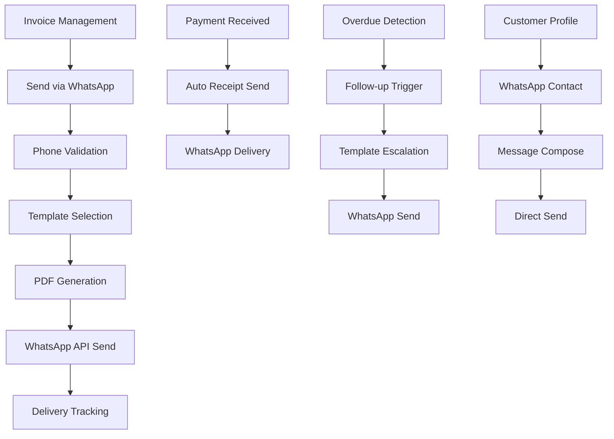

# WhatsApp Integration Product Requirements Document

## 1. Product Overview

Integrate WhatsApp Business messaging capabilities into the invoice management system to enable seamless customer communication through the world's most popular messaging platform. This feature allows businesses to send invoices, receipts, follow-up reminders, and maintain customer relationships directly through WhatsApp, improving payment collection rates and customer engagement.

The integration targets small to medium businesses who rely on WhatsApp for customer communication and want to streamline their invoice delivery and payment collection processes.

## 2. Core Features

### 2.1 User Roles

| Role | Registration Method | Core Permissions |
|------|---------------------|------------------|
| Business Owner | Existing user account | Full WhatsApp integration access, template management, bulk messaging |
| Staff Member | Invitation by owner | Send individual messages, view message history, basic template usage |
| Customer | WhatsApp opt-in | Receive messages, view documents, respond to business |

### 2.2 Feature Module

Our WhatsApp integration consists of the following main functional areas:

1. **WhatsApp Messaging Dashboard**: Message history, delivery status tracking, customer communication overview
2. **Invoice WhatsApp Integration**: Send invoices via WhatsApp with PDF attachments and customizable messages
3. **Receipt WhatsApp Integration**: Automatic receipt delivery via WhatsApp upon payment confirmation
4. **Follow-up Management**: Automated and manual follow-up messages for overdue invoices with escalating templates
5. **Customer WhatsApp Management**: Customer opt-in management, phone number validation, communication preferences
6. **Template Management**: Create, edit, and manage message templates for different communication scenarios
7. **WhatsApp Settings**: API configuration, webhook setup, business profile management

### 2.3 Page Details

| Page Name | Module Name | Feature Description |
|-----------|-------------|---------------------|
| WhatsApp Dashboard | Message Overview | Display recent WhatsApp messages, delivery statistics, failed messages, and quick action buttons |
| WhatsApp Dashboard | Communication Timeline | Show chronological message history with customers, message status indicators, and response tracking |
| Invoice Details | WhatsApp Send Button | Send invoice PDF via WhatsApp with customizable message, phone number validation, and delivery confirmation |
| Invoice Details | WhatsApp Status | Display WhatsApp delivery status, read receipts, and message history for specific invoice |
| Invoice List | Bulk WhatsApp Actions | Select multiple invoices and send via WhatsApp with batch processing and progress tracking |
| Receipt Generation | Auto WhatsApp Send | Automatically send receipt via WhatsApp when payment is marked as received with customizable templates |
| Customer Profile | WhatsApp Opt-in Toggle | Enable/disable WhatsApp communications for customer with consent tracking and preference management |
| Customer Profile | WhatsApp Contact | Quick WhatsApp message button with phone number validation and message composition |
| Customer Profile | Message History | View all WhatsApp communications with customer, message status, and response timeline |
| Follow-up Management | Overdue Invoice Actions | Send follow-up messages for overdue invoices with template selection and escalation scheduling |
| Follow-up Management | Automated Reminders | Configure automatic follow-up schedules with customizable timing and template progression |
| Template Management | Template Editor | Create and edit WhatsApp message templates with variable placeholders and preview functionality |
| Template Management | Template Library | Manage collection of templates organized by type (invoice, receipt, follow-up) with activation controls |
| WhatsApp Settings | API Configuration | Configure WhatsApp Business API credentials, phone number setup, and webhook endpoints |
| WhatsApp Settings | Business Profile | Manage WhatsApp Business profile information, verification status, and messaging limits |

## 3. Core Process

### 3.1 Invoice WhatsApp Delivery Flow
1. User creates or selects an existing invoice
2. User clicks "Send via WhatsApp" button in invoice details
3. System validates customer phone number and WhatsApp opt-in status
4. User selects or customizes message template
5. System generates invoice PDF and sends via WhatsApp Business API
6. System tracks message delivery status and updates invoice record
7. Customer receives invoice with PDF attachment via WhatsApp
8. System logs communication history and delivery confirmation

### 3.2 Receipt WhatsApp Delivery Flow
1. User marks invoice as paid or payment is automatically detected
2. System triggers receipt generation process
3. System checks customer WhatsApp opt-in preferences
4. System generates receipt PDF using existing receipt generator
5. System sends receipt via WhatsApp with payment confirmation message
6. Customer receives receipt confirmation via WhatsApp
7. System updates payment record with WhatsApp delivery status

### 3.3 Follow-up Management Flow
1. System identifies overdue invoices based on due dates
2. User manually triggers follow-up or system runs automated schedule
3. System selects appropriate template based on overdue duration
4. User reviews and customizes follow-up message if needed
5. System sends follow-up message via WhatsApp
6. System schedules next follow-up based on escalation rules
7. User can track follow-up effectiveness and customer responses

### 3.4 Customer Communication Flow
1. User navigates to customer profile or contact list
2. User clicks WhatsApp contact button for specific customer
3. System validates phone number and opt-in status
4. User composes custom message or selects template
5. System sends message via WhatsApp Business API
6. System logs communication in customer history
7. User can track message delivery and customer responses

## 4. User Interface Design

### 4.1 Design Style

- **Primary Colors**: WhatsApp Green (#25D366) for WhatsApp-related actions, existing brand colors for other elements
- **Secondary Colors**: Gray (#6B7280) for status indicators, Red (#EF4444) for failed messages, Green (#10B981) for delivered messages
- **Button Style**: Rounded buttons with WhatsApp icon integration, consistent with existing shadcn/ui design system
- **Font**: Inter font family maintaining consistency with existing application
- **Layout Style**: Card-based design with clear visual hierarchy, integrated seamlessly with existing dashboard layout
- **Icons**: WhatsApp official icons, Lucide React icons for status indicators, consistent icon sizing (16px, 20px, 24px)

### 4.2 Page Design Overview

| Page Name | Module Name | UI Elements |
|-----------|-------------|-------------|
| WhatsApp Dashboard | Message Overview | Card layout with message statistics, green accent colors, WhatsApp logo integration, responsive grid system |
| WhatsApp Dashboard | Recent Messages | Timeline component with message bubbles, delivery status icons, customer avatars, infinite scroll |
| Invoice Details | WhatsApp Actions | Green "Send via WhatsApp" button with WhatsApp icon, status badge showing delivery state, message history accordion |
| Customer Profile | WhatsApp Section | Toggle switch for opt-in status, WhatsApp contact button, message history table with status columns |
| Template Management | Template Editor | Rich text editor with variable insertion buttons, template preview pane, save/cancel actions |
| Follow-up Management | Overdue Actions | Bulk selection checkboxes, template dropdown selector, send progress modal, escalation timeline |
| WhatsApp Settings | Configuration | Form inputs for API credentials, connection status indicator, test message functionality |

### 4.3 Responsiveness

The WhatsApp integration is designed mobile-first with responsive breakpoints:
- **Mobile (320px-768px)**: Stacked layout, full-width buttons, simplified navigation, touch-optimized controls
- **Tablet (768px-1024px)**: Two-column layout, condensed message history, medium-sized action buttons
- **Desktop (1024px+)**: Multi-column dashboard, expanded message details, hover states, keyboard shortcuts

Touch interaction optimization includes larger tap targets for mobile devices, swipe gestures for message navigation, and pull-to-refresh functionality for message updates.

## 5. Functional Requirements

### 5.1 WhatsApp Business API Integration
- Connect to WhatsApp Cloud API using business account credentials
- Support for text messages with PDF attachments up to 16MB
- Real-time webhook handling for message status updates
- Rate limiting compliance with WhatsApp API restrictions
- Error handling for failed message delivery

### 5.2 Message Template System
- Dynamic variable substitution (customer name, invoice number, amounts, dates)
- Template versioning and approval workflow
- Multi-language template support
- Template performance analytics
- Compliance with WhatsApp Business Policy

### 5.3 Customer Consent Management
- Explicit opt-in tracking for WhatsApp communications
- Opt-out mechanism with immediate effect
- Consent timestamp logging for compliance
- GDPR-compliant data handling
- Customer preference management

### 5.4 Delivery and Status Tracking
- Real-time message status updates (sent, delivered, read)
- Failed message retry mechanism
- Delivery analytics and reporting
- Message history with searchable interface
- Export functionality for communication records

### 5.5 Security and Privacy
- End-to-end encryption for sensitive data
- Secure storage of WhatsApp API credentials
- Access control for WhatsApp features
- Audit logging for all communications
- Data retention policy compliance

## 6. Non-Functional Requirements

### 6.1 Performance
- Message sending response time under 3 seconds
- PDF generation and attachment under 5 seconds
- Dashboard loading time under 2 seconds
- Support for 1000+ messages per day
- 99.9% uptime for WhatsApp integration

### 6.2 Scalability
- Horizontal scaling for high message volumes
- Queue-based message processing
- Database optimization for message history
- CDN integration for PDF delivery
- Load balancing for webhook handling

### 6.3 Reliability
- Automatic retry for failed messages
- Fallback mechanisms for API failures
- Data backup and recovery procedures
- Monitoring and alerting for system health
- Graceful degradation when WhatsApp is unavailable

## 7. Success Metrics

### 7.1 User Engagement
- WhatsApp message open rates (target: >90%)
- Customer response rates (target: >30%)
- Invoice payment time reduction (target: 25% faster)
- User adoption of WhatsApp features (target: >60%)

### 7.2 Business Impact
- Reduction in overdue invoices (target: 40% decrease)
- Improved customer satisfaction scores
- Increased payment collection efficiency
- Reduced manual follow-up time

### 7.3 Technical Performance
- Message delivery success rate (target: >98%)
- API response time consistency
- System uptime and reliability
- Error rate monitoring and reduction

## 8. Compliance and Legal

### 8.1 WhatsApp Business Policy
- Compliance with WhatsApp Business messaging guidelines
- Proper use of business messaging templates
- Respect for customer communication preferences
- Adherence to spam prevention policies

### 8.2 Data Protection
- GDPR compliance for EU customers
- Data minimization principles
- Right to erasure implementation
- Privacy policy updates

### 8.3 Business Regulations
- Invoice delivery legal requirements
- Electronic document standards
- Customer consent documentation
- Financial record keeping compliance