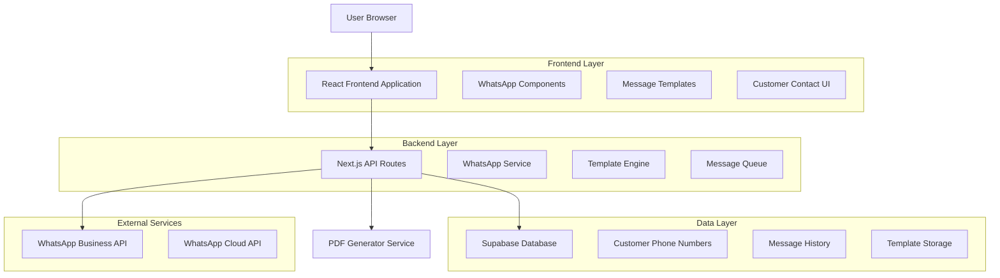
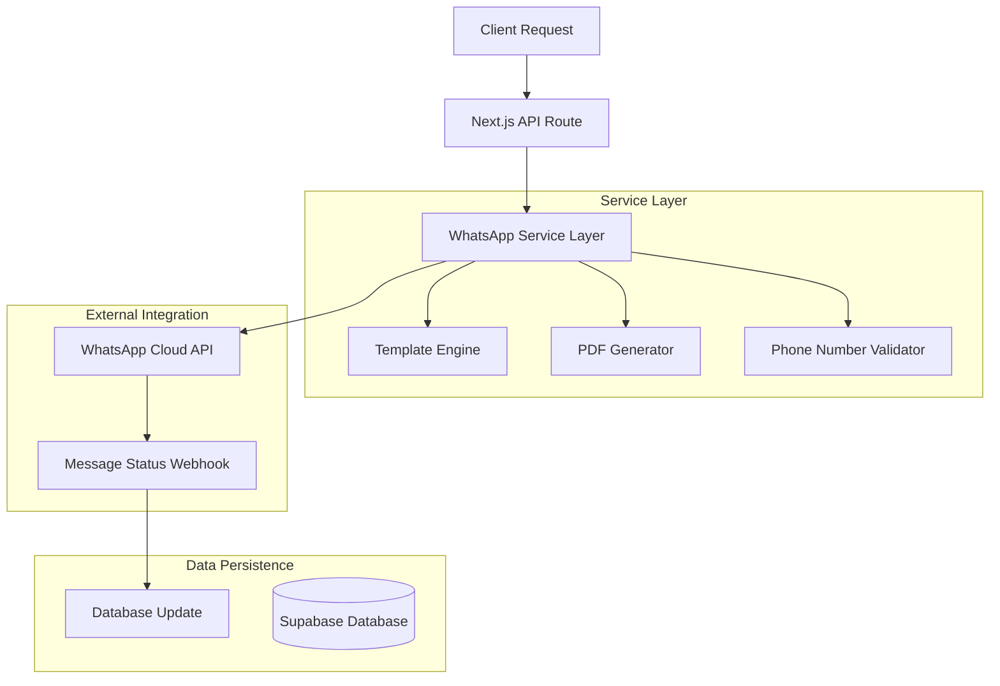
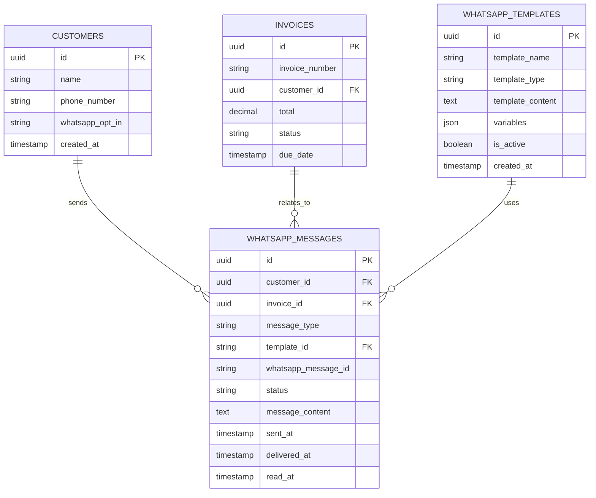

# WhatsApp Integration Technical Architecture

## 1. Architecture Design



## 2. Technology Description

- Frontend: React@18 + Next.js@14 + tailwindcss@3 + shadcn/ui
- Backend: Next.js API Routes + WhatsApp Business API
- Database: Supabase (PostgreSQL)
- Message Queue: Supabase Realtime (for message status tracking)
- PDF Generation: jsPDF (existing)
- WhatsApp Integration: WhatsApp Cloud API

## 3. Route Definitions

| Route | Purpose |
|-------|----------|
| /api/whatsapp/send-invoice | Send invoice PDF via WhatsApp |
| /api/whatsapp/send-receipt | Send receipt PDF via WhatsApp |
| /api/whatsapp/send-followup | Send follow-up message for overdue invoices |
| /api/whatsapp/send-message | Send custom message to customer |
| /api/whatsapp/templates | Manage message templates |
| /api/whatsapp/webhook | Handle WhatsApp webhook events |

## 4. API Definitions

### 4.1 Core WhatsApp APIs

**Send Invoice via WhatsApp**
```
POST /api/whatsapp/send-invoice
```

Request:
| Param Name | Param Type | isRequired | Description |
|------------|------------|------------|--------------|
| invoiceId | string | true | Invoice ID to send |
| phoneNumber | string | true | Customer phone number (E.164 format) |
| customMessage | string | false | Optional custom message |

Response:
| Param Name | Param Type | Description |
|------------|------------|-------------|
| success | boolean | Status of message send |
| messageId | string | WhatsApp message ID |
| error | string | Error message if failed |

**Send Receipt via WhatsApp**
```
POST /api/whatsapp/send-receipt
```

Request:
| Param Name | Param Type | isRequired | Description |
|------------|------------|------------|--------------|
| invoiceId | string | true | Invoice ID for receipt |
| phoneNumber | string | true | Customer phone number |
| customMessage | string | false | Optional custom message |

**Send Follow-up Message**
```
POST /api/whatsapp/send-followup
```

Request:
| Param Name | Param Type | isRequired | Description |
|------------|------------|------------|--------------|
| invoiceId | string | true | Overdue invoice ID |
| templateType | string | true | Template type (gentle, urgent, final) |
| phoneNumber | string | true | Customer phone number |

**Send Custom Message**
```
POST /api/whatsapp/send-message
```

Request:
| Param Name | Param Type | isRequired | Description |
|------------|------------|------------|--------------|
| customerId | string | true | Customer ID |
| message | string | true | Message content |
| phoneNumber | string | true | Customer phone number |

## 5. Server Architecture Diagram



## 6. Data Model

### 6.1 Data Model Definition



### 6.2 Data Definition Language

**WhatsApp Messages Table**
```sql
CREATE TABLE whatsapp_messages (
    id UUID PRIMARY KEY DEFAULT gen_random_uuid(),
    customer_id UUID REFERENCES customers(id) ON DELETE CASCADE,
    invoice_id UUID REFERENCES invoices(id) ON DELETE SET NULL,
    message_type VARCHAR(50) NOT NULL CHECK (message_type IN ('invoice', 'receipt', 'followup', 'custom')),
    template_id UUID REFERENCES whatsapp_templates(id) ON DELETE SET NULL,
    whatsapp_message_id VARCHAR(255),
    status VARCHAR(20) DEFAULT 'pending' CHECK (status IN ('pending', 'sent', 'delivered', 'read', 'failed')),
    message_content TEXT NOT NULL,
    phone_number VARCHAR(20) NOT NULL,
    sent_at TIMESTAMP WITH TIME ZONE DEFAULT NOW(),
    delivered_at TIMESTAMP WITH TIME ZONE,
    read_at TIMESTAMP WITH TIME ZONE,
    error_message TEXT,
    created_at TIMESTAMP WITH TIME ZONE DEFAULT NOW(),
    updated_at TIMESTAMP WITH TIME ZONE DEFAULT NOW()
);

CREATE INDEX idx_whatsapp_messages_customer_id ON whatsapp_messages(customer_id);
CREATE INDEX idx_whatsapp_messages_invoice_id ON whatsapp_messages(invoice_id);
CREATE INDEX idx_whatsapp_messages_status ON whatsapp_messages(status);
CREATE INDEX idx_whatsapp_messages_sent_at ON whatsapp_messages(sent_at DESC);
```

**WhatsApp Templates Table**
```sql
CREATE TABLE whatsapp_templates (
    id UUID PRIMARY KEY DEFAULT gen_random_uuid(),
    template_name VARCHAR(100) NOT NULL UNIQUE,
    template_type VARCHAR(50) NOT NULL CHECK (template_type IN ('invoice', 'receipt', 'followup_gentle', 'followup_urgent', 'followup_final', 'custom')),
    template_content TEXT NOT NULL,
    variables JSONB DEFAULT '[]',
    is_active BOOLEAN DEFAULT true,
    created_at TIMESTAMP WITH TIME ZONE DEFAULT NOW(),
    updated_at TIMESTAMP WITH TIME ZONE DEFAULT NOW()
);

CREATE INDEX idx_whatsapp_templates_type ON whatsapp_templates(template_type);
CREATE INDEX idx_whatsapp_templates_active ON whatsapp_templates(is_active);
```

**Update Customers Table**
```sql
ALTER TABLE customers ADD COLUMN IF NOT EXISTS whatsapp_opt_in BOOLEAN DEFAULT false;
ALTER TABLE customers ADD COLUMN IF NOT EXISTS whatsapp_last_contact TIMESTAMP WITH TIME ZONE;

CREATE INDEX idx_customers_whatsapp_opt_in ON customers(whatsapp_opt_in);
```

**Initial Template Data**
```sql
INSERT INTO whatsapp_templates (template_name, template_type, template_content, variables) VALUES
('invoice_default', 'invoice', 'Hi {{customer_name}}, your invoice {{invoice_number}} for {{total_amount}} is ready. Due date: {{due_date}}. Please find the invoice attached.', '["customer_name", "invoice_number", "total_amount", "due_date"]'),
('receipt_default', 'receipt', 'Hi {{customer_name}}, thank you for your payment! Your receipt for invoice {{invoice_number}} ({{total_amount}}) is attached.', '["customer_name", "invoice_number", "total_amount"]'),
('followup_gentle', 'followup_gentle', 'Hi {{customer_name}}, this is a friendly reminder that invoice {{invoice_number}} for {{total_amount}} was due on {{due_date}}. Please let us know if you need any assistance.', '["customer_name", "invoice_number", "total_amount", "due_date"]'),
('followup_urgent', 'followup_urgent', 'Hi {{customer_name}}, invoice {{invoice_number}} for {{total_amount}} is now {{days_overdue}} days overdue. Please arrange payment as soon as possible.', '["customer_name", "invoice_number", "total_amount", "days_overdue"]'),
('followup_final', 'followup_final', 'Hi {{customer_name}}, this is a final notice for invoice {{invoice_number}} ({{total_amount}}), which is {{days_overdue}} days overdue. Please contact us immediately to avoid further action.', '["customer_name", "invoice_number", "total_amount", "days_overdue"]');
```

## 7. Security Considerations

### 7.1 WhatsApp Business API Security
- Store WhatsApp Access Token securely in environment variables
- Implement webhook signature verification
- Rate limiting for API calls
- Phone number validation and sanitization

### 7.2 Data Privacy
- Customer opt-in tracking for WhatsApp communications
- Message content encryption in database
- GDPR compliance for message history
- Automatic message deletion after retention period

### 7.3 Access Control
- User authentication required for all WhatsApp operations
- Role-based permissions for template management
- Audit logging for all WhatsApp communications

## 8. Message Templates

### 8.1 Template Variables
- `{{customer_name}}` - Customer name
- `{{invoice_number}}` - Invoice number
- `{{total_amount}}` - Formatted total amount
- `{{due_date}}` - Formatted due date
- `{{days_overdue}}` - Number of days overdue
- `{{company_name}}` - Company name
- `{{payment_link}}` - Payment link (if available)

### 8.2 Template Types
- **Invoice**: New invoice notification with PDF
- **Receipt**: Payment confirmation with receipt PDF
- **Follow-up Gentle**: Polite overdue reminder
- **Follow-up Urgent**: Firm overdue notice
- **Follow-up Final**: Final notice before collection
- **Custom**: User-defined messages

## 9. User Interface Components

### 9.1 WhatsApp Integration Points

**Invoice Actions**
- Send via WhatsApp button in invoice details
- Bulk WhatsApp send for multiple invoices
- WhatsApp status indicator in invoice list

**Customer Management**
- WhatsApp opt-in toggle in customer profile
- WhatsApp contact button with phone validation
- Message history view in customer details

**Follow-up Management**
- Automated follow-up scheduling
- Manual follow-up with template selection
- Overdue invoice WhatsApp bulk actions

### 9.2 UI Components Structure
```
src/components/whatsapp/
├── whatsapp-send-button.tsx
├── whatsapp-template-selector.tsx
├── whatsapp-message-history.tsx
├── whatsapp-opt-in-toggle.tsx
├── whatsapp-bulk-actions.tsx
└── whatsapp-status-indicator.tsx
```

## 10. Implementation Phases

### Phase 1: Core Infrastructure
- WhatsApp Business API setup
- Database schema implementation
- Basic message sending functionality

### Phase 2: Invoice & Receipt Integration
- PDF attachment support
- Invoice/receipt WhatsApp buttons
- Message status tracking

### Phase 3: Template System
- Template management interface
- Variable substitution engine
- Follow-up automation

### Phase 4: Advanced Features
- Bulk messaging
- Message scheduling
- Analytics and reporting

## 11. Configuration Requirements

### 11.1 Environment Variables
```
WHATSAPP_ACCESS_TOKEN=your_whatsapp_access_token
WHATSAPP_PHONE_NUMBER_ID=your_phone_number_id
WHATSAPP_WEBHOOK_VERIFY_TOKEN=your_webhook_verify_token
WHATSAPP_WEBHOOK_SECRET=your_webhook_secret
```

### 11.2 WhatsApp Business API Setup
- Facebook Developer Account
- WhatsApp Business Account
- Phone number verification
- Webhook endpoint configuration

## 12. Error Handling & Monitoring

### 12.1 Error Scenarios
- Invalid phone numbers
- WhatsApp API rate limits
- Message delivery failures
- PDF generation errors

### 12.2 Monitoring
- Message delivery rates
- API response times
- Error frequency tracking
- Customer engagement metrics